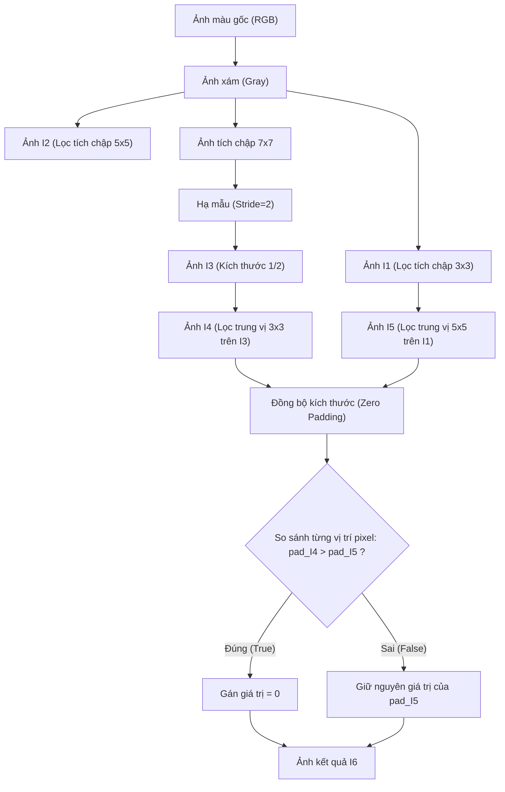

# 📘 TÀI LIỆU GIẢI THÍCH VÀ HƯỚNG DẪN TỰ CODE – PHÉP TÍCH CHẬP VÀ MEDIAN FILTER

**Mục đích:** Giúp hiểu bản chất của phép tích chập (Convolution), lọc trung vị (Median Filter) và cách xây dựng các ảnh $I_1, I_2, I_3, I_4, I_5, I_6$ theo đúng yêu cầu đề bài môn Xử lý ảnh số.

---

## MỤC LỤC
1. [Đề bài](#1-đề-bài)
2. [Chuyển ảnh màu sang ảnh xám](#2-chuyển-ảnh-màu-sang-ảnh-xám)
3. [Phép tích chập (Convolution)](#3-phép-tích-chập-convolution)
4. [Tạo ảnh $I_1$ bằng Kernel $3 \times 3$](#4-tạo-ảnh-i_1-bằng-kernel-3--3)
5. [Tạo ảnh $I_2$ bằng Kernel $5 \times 5$](#5-tạo-ảnh-i_2-bằng-kernel-5--5)
6. [Tạo ảnh $I_3$ bằng Kernel $7 \times 7$ và Stride = 2](#6-tạo-ảnh-i_3-bằng-kernel-7--7-và-stride--2)
7. [Lọc trung vị (Median Filter)](#7-lọc-trung-vị-median-filter)
8. [Tạo ảnh $I_4$](#8-tạo-ảnh-i_4)
9. [Tạo ảnh $I_5$](#9-tạo-ảnh-i_5)
10. [Đồng bộ kích thước ảnh](#10-đồng-bộ-kích-thước-ảnh)
11. [Tạo ảnh $I_6$](#11-tạo-ảnh-i_6)
12. [Quy trình xử lý toàn bộ ảnh](#12-quy-trình-xử-lý-toàn-bộ-ảnh)
13. [Hướng dẫn tự viết mã nguồn (Python & OpenCV)](#13-hướng-dẫn-tự-viết-mã-nguồn-python--opencv)
14. [Bảng tổng kết thông số](#14-bảng-tổng-kết-thông-số)

---

## 1. ĐỀ BÀI
Cho ảnh màu $I$ kích thước $n \times m$. Thực hiện tuần tự các bước sau:
1. Chuyển ảnh màu sang ảnh xám.
2. Tạo $I_1$ bằng cách áp dụng bộ lọc trung bình (kernel $3 \times 3$) lên ảnh xám.
3. Tạo $I_2$ bằng bộ lọc trung bình (kernel $5 \times 5$) lên ảnh xám.
4. Tạo $I_3$ bằng bộ lọc trung bình (kernel $7 \times 7$) lên ảnh xám với bước trượt **Stride = 2**.
5. Tạo $I_4$ bằng lọc trung vị (Median Filter $3 \times 3$) trên ảnh $I_3$.
6. Tạo $I_5$ bằng lọc trung vị (Median Filter $5 \times 5$) trên ảnh $I_1$.
7. Đồng bộ kích thước ảnh nhỏ hơn (dùng padding điền giá trị 0) để có thể so sánh trực tiếp.
8. Tạo ảnh $I_6$ dựa trên luật so sánh:
   $$\text{Nếu } I_4(x,y) > I_5(x,y) \implies I_6(x,y) = 0$$
   $$\text{Ngược lại } \implies I_6(x,y) = I_5(x,y)$$

---

## 2. CHUYỂN ẢNH MÀU SANG ẢNH XÁM

### Tại sao phải chuyển?
Hầu hết các bộ lọc không gian (như tích chập, lọc trung vị) làm việc trên một kênh cường độ sáng đơn lẻ. Do đó, ảnh màu RGB (3 kênh màu) cần được chuyển về ảnh xám (1 kênh sáng) để đơn giản hóa thuật toán và bảo toàn ý nghĩa cấu trúc hình học.

### Công thức chuẩn hóa (Luminance)
$$Y = 0.299R + 0.587G + 0.114B$$

### Thực hiện trong mã nguồn
```python
import cv2

# Đọc ảnh màu (dạng BGR trong OpenCV)
img = cv2.imread('path_to_image.jpg')
# Chuyển đổi sang ảnh xám
gray = cv2.cvtColor(img, cv2.COLOR_BGR2GRAY)
```

---

## 3. PHÉP TÍCH CHẬP (CONVOLUTION)

### Ý tưởng cơ bản
Một ma trận trọng số (gọi là **kernel**) trượt qua từng pixel của ảnh gốc. Tại mỗi vị trí dừng:
1. Nhân từng phần tử của kernel với mức xám của pixel tương ứng trên ảnh.
2. Cộng tổng tất cả các tích lại.
3. Gán giá trị kết quả này cho pixel tại vị trí trung tâm ở ảnh đầu ra.

### Minh họa tính toán cụ thể
Giả sử ta dùng bộ lọc trung bình **Kernel $3 \times 3$**:
$$K = \frac{1}{9} \begin{bmatrix} 1 & 1 & 1 \\ 1 & 1 & 1 \\ 1 & 1 & 1 \end{bmatrix}$$

Và vùng ảnh $3 \times 3$ đang xét có các giá trị pixel như sau:
$$A = \begin{bmatrix} 100 & 120 & 140 \\ 90 & 110 & 130 \\ 80 & 100 & 120 \end{bmatrix}$$

Giá trị đầu ra tại pixel trung tâm sẽ là:
$$\text{Output} = \frac{100 \times 1 + 120 \times 1 + 140 \times 1 + 90 \times 1 + 110 \times 1 + 130 \times 1 + 80 \times 1 + 100 \times 1 + 120 \times 1}{9}$$
$$\text{Output} = \frac{990}{9} = 110$$

---

## 4. TẠO ẢNH $I_1$ – KERNEL $3 \times 3$

* **Kernel:** Ma trận $3 \times 3$ chứa các giá trị $\frac{1}{9}$ (bộ lọc trung bình làm mịn ảnh).
* **Padding:** Chọn $P = 1$ để giữ nguyên kích thước ảnh gốc.
  * Công thức xác định biên: $P = \frac{W - 1}{2} = \frac{3 - 1}{2} = 1$ (với $W$ là kích thước cạnh kernel).

```python
import numpy as np

# Tạo bộ lọc trung bình 3x3
kernel3 = np.ones((3, 3), dtype=np.float32) / 9.0
# Thực hiện lọc tích chập, giữ hằng số biên (Border Constant = 0)
I1 = cv2.filter2D(gray, -1, kernel3, borderType=cv2.BORDER_CONSTANT)
```

---

## 5. TẠO ẢNH $I_2$ – KERNEL $5 \times 5$

* **Kernel:** Ma trận $5 \times 5$ chứa các giá trị $\frac{1}{25}$. Ảnh đầu ra sẽ mờ và mịn hơn ảnh $I_1$.
* **Padding:** Chọn $P = \frac{5 - 1}{2} = 2$.

```python
# Tạo bộ lọc trung bình 5x5
kernel5 = np.ones((5, 5), dtype=np.float32) / 25.0
# Thực hiện lọc tích chập
I2 = cv2.filter2D(gray, -1, kernel5, borderType=cv2.BORDER_CONSTANT)
```

---

## 6. TẠO ẢNH $I_3$ – KERNEL $7 \times 7$ VÀ STRIDE = 2

* **Kernel:** Ma trận $7 \times 7$ chứa các giá trị $\frac{1}{49}$.
* **Padding:** $P = \frac{7 - 1}{2} = 3$.
* **Stride = 2:** Bước dịch chuyển của kernel là 2 pixel thay vì 1 pixel. Thao tác này sẽ làm giảm kích thước của ảnh xuống còn một nửa (tương tự như phép hạ mẫu - downsampling).

### Quy trình lập trình
1. **Bước 1:** Lọc tích chập thông thường với Kernel $7 \times 7$ và Padding = 3.
2. **Bước 2:** Lấy mẫu cách hàng cách cột (mô phỏng Stride = 2).

```python
# Lọc với kernel 7x7 trước
kernel7 = np.ones((7, 7), dtype=np.float32) / 49.0
temp = cv2.filter2D(gray, -1, kernel7, borderType=cv2.BORDER_CONSTANT)

# Hạ mẫu bước trượt bằng cách lấy cách hàng cách cột
I3 = temp[::2, ::2]
```
*(Ví dụ: Nếu ảnh gốc kích thước $600 \times 800$, ảnh $I_3$ sẽ có kích thước khoảng $300 \times 400$).*

---

## 7. LỌC TRUNG VỊ (MEDIAN FILTER)

### Ý tưởng cơ bản
Bộ lọc trung vị không tính giá trị trung bình mà tìm số nằm giữa. Bộ lọc này cực kỳ hiệu quả để loại bỏ **nhiễu muối tiêu** (salt-and-pepper noise) mà không làm mờ các cạnh biên của ảnh.

Các bước thực hiện tại mỗi cửa sổ trượt:
1. Thu thập toàn bộ giá trị pixel trong cửa sổ.
2. Sắp xếp dãy giá trị này theo thứ tự tăng dần.
3. Tìm phần tử nằm chính giữa dãy số và gán vào pixel đầu ra.

### Ví dụ minh họa
Cửa sổ lọc trung vị $3 \times 3$ xung quanh điểm ảnh:
$$W = \begin{bmatrix} 20 & 50 & 40 \\ 80 & 90 & 10 \\ 60 & 30 & 70 \end{bmatrix}$$

* Sắp xếp dãy số tăng dần: $10, 20, 30, 40, \mathbf{50}, 60, 70, 80, 90$
* Phần tử trung vị ở giữa (phần tử thứ 5): **$50$**
* Giá trị đầu ra tại tâm được gán bằng $50$.

---

## 8. TẠO ẢNH $I_4$

* **Phương pháp:** Lọc trung vị với cửa sổ kích thước $3 \times 3$ trên ảnh **$I_3$**.

```python
# Áp dụng bộ lọc trung vị kích thước cửa sổ 3
I4 = cv2.medianBlur(I3, 3)
```

---

## 9. TẠO ẢNH $I_5$

* **Phương pháp:** Lọc trung vị với cửa sổ kích thước $5 \times 5$ trên ảnh **$I_1$**.

```python
# Áp dụng bộ lọc trung vị kích thước cửa sổ 5
I5 = cv2.medianBlur(I1, 5)
```

---

## 10. ĐỒNG BỘ KÍCH THƯỚC ẢNH

### Vấn đề gặp phải
* Ảnh $I_4$ được tạo từ ảnh hạ mẫu $I_3$ (có Stride = 2) nên có kích thước nhỏ bằng khoảng một nửa ảnh $I_5$ (được tạo từ $I_1$ có kích thước gốc).
* Để so sánh từng pixel phục vụ cho việc tạo ảnh $I_6$, ta bắt buộc phải đồng bộ kích thước hai ảnh này về cùng một cỡ lớn nhất.

### Giải pháp
Tạo các khung ảnh trống có kích thước lớn tương đương với ảnh $I_5$, sau đó đặt ảnh nhỏ $I_4$ vào góc trên-trái, phần còn lại điền giá trị 0 (Zero Padding).

```python
# Lấy kích thước ảnh lớn hơn (ở đây là I5)
h_max, w_max = I5.shape

# Khởi tạo ma trận trống bằng 0
pad_I4 = np.zeros((h_max, w_max), dtype=np.uint8)
pad_I5 = I5.copy()  # I5 đã có sẵn kích thước chuẩn

# Chép ảnh nhỏ I4 vào góc trên cùng bên trái của khung trống
h_small, w_small = I4.shape
pad_I4[0:h_small, 0:w_small] = I4
```

---

## 11. TẠO ẢNH $I_6$

### Luật kết hợp
$$I_6(x, y) = \begin{cases} 0 & \text{nếu } I_4(x, y) > I_5(x, y) \\ I_5(x, y) & \text{nếu } I_4(x, y) \le I_5(x, y) \end{cases}$$

### Thực hiện bằng NumPy vector hóa để tối ưu hóa tốc độ
Sử dụng hàm `np.where` thay vì vòng lặp để xử lý toàn bộ ma trận trong tích tắc:

```python
# So sánh và áp luật tạo ảnh I6
I6 = np.where(pad_I4 > pad_I5, 0, pad_I5)
```

---

## 12. QUY TRÌNH XỬ LÝ TOÀN BỘ ẢNH



---

## 13. HƯỚNG DẪN TỰ VIẾT MÃ NGUỒN (PYTHON & OPENCV)

Dưới đây là đoạn mã nguồn Python hoàn chỉnh giúp bạn tự chạy kiểm thử trên máy tính cá nhân:

```python
import cv2
import numpy as np

def run_image_processing(image_path):
    # Bước A: Đọc ảnh màu và chuyển đổi sang ảnh xám
    img = cv2.imread(image_path)
    if img is None:
        print("Lỗi: Không tìm thấy ảnh đầu vào!")
        return
    gray = cv2.cvtColor(img, cv2.COLOR_BGR2GRAY)
    
    # Bước B: Định nghĩa các kernel lọc trung bình
    kernel3 = np.ones((3, 3), dtype=np.float32) / 9.0
    kernel5 = np.ones((5, 5), dtype=np.float32) / 25.0
    kernel7 = np.ones((7, 7), dtype=np.float32) / 49.0
    
    # Bước C: Tạo I1, I2, I3
    I1 = cv2.filter2D(gray, -1, kernel3, borderType=cv2.BORDER_CONSTANT)
    I2 = cv2.filter2D(gray, -1, kernel5, borderType=cv2.BORDER_CONSTANT)
    
    # I3 với Stride = 2
    temp = cv2.filter2D(gray, -1, kernel7, borderType=cv2.BORDER_CONSTANT)
    I3 = temp[::2, ::2]
    
    # Bước D: Tạo I4, I5 bằng Lọc trung vị
    I4 = cv2.medianBlur(I3, 3)
    I5 = cv2.medianBlur(I1, 5)
    
    # Bước E: Đồng bộ kích thước bằng cách chèn padding
    h_max, w_max = I5.shape
    pad_I4 = np.zeros((h_max, w_max), dtype=np.uint8)
    
    h_small, w_small = I4.shape
    pad_I4[0:h_small, 0:w_small] = I4
    pad_I5 = I5.copy()
    
    # Bước F: Tạo I6 theo điều kiện
    I6 = np.where(pad_I4 > pad_I5, 0, pad_I5)
    
    # Bước G: Lưu các ảnh kết quả
    cv2.imwrite('output_I1.jpg', I1)
    cv2.imwrite('output_I2.jpg', I2)
    cv2.imwrite('output_I3.jpg', I3)
    cv2.imwrite('output_I4.jpg', I4)
    cv2.imwrite('output_I5.jpg', I5)
    cv2.imwrite('output_I6.jpg', I6)
    print("Hoàn thành! Các ảnh kết quả đã được lưu.")

# Chạy thử
if __name__ == '__main__':
    run_image_processing('anh_xlas/anh_xlas/image_01.jpg')
```

---

## 14. BẢNG TỔNG KẾT THÔNG SỐ

| Ảnh | Phương pháp xử lý | Cửa sổ / Bộ lọc | Padding (Biên) | Stride (Bước trượt) | Đặc trưng & Tác dụng chính |
| :---: | :--- | :---: | :---: | :---: | :--- |
| **$I_1$** | Tích chập trung bình | $3 \times 3$ | $1$ (Constant) | $1$ | Làm mịn mờ ảnh nhẹ, giảm nhiễu hạt nhỏ. |
| **$I_2$** | Tích chập trung bình | $5 \times 5$ | $2$ (Constant) | $1$ | Làm mịn ảnh mạnh hơn, mờ các chi tiết nhỏ. |
| **$I_3$** | Tích chập trung bình | $7 \times 7$ | $3$ (Constant) | $2$ | Mịn hóa diện rộng và giảm một nửa kích thước ảnh. |
| **$I_4$** | Lọc trung vị (Median) | $3 \times 3$ | $-$ | $1$ | Khử nhiễu muối tiêu hiệu quả trên ảnh thu nhỏ $I_3$. |
| **$I_5$** | Lọc trung vị (Median) | $5 \times 5$ | $-$ | $1$ | Khử nhiễu muối tiêu diện rộng trên ảnh mịn $I_1$. |
| **$I_6$** | So sánh logic có điều kiện | $-$ | $-$ | $-$ | Tạo mặt nạ vùng sáng tối: Giữ $I_5$ nếu $I_4 \le I_5$, ngược lại xóa về $0$. |

> [!TIP]
> **Mẹo kiểm tra nhanh tính đúng đắn của kết quả:**
> * Kích thước ảnh: $I_1, I_2, I_5, I_6$ phải bằng nhau. $I_3, I_4$ nhỏ bằng $1/4$ diện tích các ảnh còn lại.
> * Độ mịn: Ảnh $I_2$ phải có độ mờ mịn (blur) cao hơn rõ rệt so với ảnh $I_1$.
> * Đặc trưng ảnh $I_6$: Sẽ xuất hiện nhiều khu vực bị triệt tiêu về $0$ (tối đen hoàn toàn) tại những nơi mà ảnh xám trung vị của $I_3$ có cường độ sáng vượt trội so với $I_5$.
