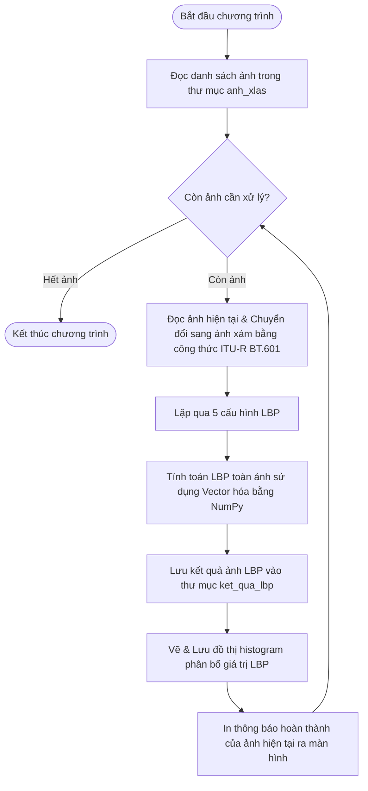

# 📘 HƯỚNG DẪN GIẢI TAY LBP & GIẢI THÍCH LUỒNG HOẠT ĐỘNG CỦA CODE

Tài liệu này được biên soạn nhằm giúp bạn và đồng nghiệp dễ dàng hiểu được bản chất toán học của thuật toán LBP (để phục vụ việc tính toán thủ công/giải tay) cũng như cách thức mã nguồn Python triển khai thuật toán này trong cả hai phiên bản: tuần tự (vòng lặp) và song song (vector hóa).

---

## MỤC LỤC
1. [HƯỚNG DẪN CÁC BƯỚC GIẢI TAY LBP](#1-hướng-dẫn-các-bước-giải-tay-lbp)
2. [VÍ DỤ SỐ MINH HỌA GIẢI TAY CHI TIẾT](#2-ví-dụ-số-minh-họa-giải-tay-chi-tiết)
3. [LUỒNG HOẠT ĐỘNG CỦA MÃ NGUỒN (WORKFLOW)](#3-luồng-hoạt-động-của-mã-nguồn-workflow)
4. [SỰ TƯƠNG ĐỒNG GIỮA CODE VÒNG LẶP VÀ VECTOR HÓA](#4-sự-tương-đồng-giữa-code-vòng-lặp-và-vector-hóa)

---

## 1. HƯỚNG DẪN CÁC BƯỚC GIẢI TAY LBP

Để giải tay giá trị LBP cho một pixel trung tâm $C(cx, cy)$ bất kỳ với tham số $P$ (số điểm lân cận) và $R$ (bán kính), ta thực hiện lần lượt 5 bước sau:

### Bước 1: Tính tọa độ thực của các điểm lân cận thứ $p$
Với $p = 0, 1, ..., P-1$, góc tương ứng là $\theta_p = \frac{2\pi \cdot p}{P}$ (hoặc $\frac{360^\circ \cdot p}{P}$):
* $x_p = cx + R \cdot \cos(\theta_p)$
* $y_p = cy - R \cdot \sin(\theta_p)$ *(Lưu ý: dấu trừ vì trục Y của ảnh đi từ trên xuống dưới)*

### Bước 2: Nội suy song tuyến (Bilinear Interpolation) để tính giá trị sáng $g_p$
Nếu tọa độ thực $(x_p, y_p)$ là số nguyên, ta lấy trực tiếp giá trị pixel tại đó.  
Nếu $(x_p, y_p)$ là số thập phân, ta xác định 4 pixel nguyên bao quanh:
* Tọa độ góc trái-trên: $x_0 = \lfloor x_p \rfloor, \; y_0 = \lfloor y_p \rfloor \rightarrow$ Giá trị: $f_{00}$
* Tọa độ góc phải-trên: $x_1 = x_0 + 1, \; y_0 \rightarrow$ Giá trị: $f_{01}$
* Tọa độ góc trái-dưới: $x_0, \; y_1 = y_0 + 1 \rightarrow$ Giá trị: $f_{10}$
* Tọa độ góc phải-dưới: $x_1, \; y_1 \rightarrow$ Giá trị: $f_{11}$

Tính phần lẻ (khoảng cách): $dx = x_p - x_0, \quad dy = y_p - y_0$.  
Công thức tính giá trị nội suy $g_p$:
$$g_p = (1-dy)(1-dx) \cdot f_{00} + (1-dy)dx \cdot f_{01} + dy(1-dx) \cdot f_{10} + dydx \cdot f_{11}$$

### Bước 3: Tạo chuỗi bit nhị phân
So sánh giá trị lân cận $g_p$ với giá trị pixel trung tâm $g_c$:
$$\text{bit}_p = \begin{cases} 1 & \text{nếu } g_p \geq g_c \\ 0 & \text{nếu } g_p < g_c \end{cases}$$
Ta thu được chuỗi $P$ bits theo thứ tự: $[\text{bit}_0, \text{bit}_1, ..., \text{bit}_{P-1}]$.

### Bước 4: Tách nhóm 8-bit và quy đổi sang số thập phân
* Nếu **P=8**: Ta có 1 nhóm duy nhất. Giá trị LBP:
  $$V_1 = \sum_{i=0}^{7} \text{bit}_i \times 2^i$$
* Nếu **P=16**: Tách thành 2 nhóm 8-bit:
  * Nhóm 1: $[\text{bit}_0 \dots \text{bit}_7] \rightarrow V_1 = \sum_{i=0}^{7} \text{bit}_i \times 2^i$
  * Nhóm 2: $[\text{bit}_8 \dots \text{bit}_{15}] \rightarrow V_2 = \sum_{i=0}^{7} \text{bit}_{i+8} \times 2^i$
* Nếu **P=24**: Tách thành 3 nhóm 8-bit tương tự để được $V_1, V_2, V_3$.

*(Lưu ý: $\text{bit}_0, \text{bit}_8, \text{bit}_{16}$ luôn là LSB - bit có trọng số nhỏ nhất $2^0$ trong nhóm của chúng).*

### Bước 5: Lấy giá trị lớn nhất (MAX)
Gán giá trị LBP cho pixel trung tâm:
$$\text{LBP}(cx, cy) = \max(V_1, V_2, \dots)$$

---

## 2. VÍ DỤ SỐ MINH HỌA GIẢI TAY CHI TIẾT

Giả sử ta cần tính LBP tại pixel trung tâm có tọa độ **(cx=4, cy=4)** với cấu hình **P=8, R=1**.  
Giá trị pixel trung tâm: **$g_c = 120$**.

Ma trận ảnh xám $3\times3$ xung quanh điểm này như sau:
```
         col=3     col=4     col=5
row=3: [f=110]   [f=100]   [f=130]
row=4: [f=140]   [ C=120]  [f=125]
row=5: [f=105]   [f=90]    [f=150]
```

### Ví dụ tính cho hướng $p=1$ (góc $45^\circ$):
1. **Tính tọa độ lân cận thứ 1:**
   $$\theta_1 = 45^\circ = \frac{\pi}{4}$$
   $$x_1 = 4 + 1 \cdot \cos(45^\circ) = 4 + 0.707 = 4.707$$
   $$y_1 = 4 - 1 \cdot \sin(45^\circ) = 4 - 0.707 = 3.293$$

2. **Nội suy song tuyến cho điểm (4.707, 3.293):**
   * Bốn điểm góc xung quanh:
     * $x_0 = \lfloor 4.707 \rfloor = 4, \quad y_0 = \lfloor 3.293 \rfloor = 3$
     * Trái-trên: $f_{00} = \text{ảnh}[3, 4] = 100$
     * Phải-trên: $f_{01} = \text{ảnh}[3, 5] = 130$
     * Trái-dưới: $f_{10} = \text{ảnh}[4, 4] = 120$
     * Phải-dưới: $f_{11} = \text{ảnh}[4, 5] = 125$
   * Phần lẻ:
     * $dx = 4.707 - 4 = 0.707$
     * $dy = 3.293 - 3 = 0.293$
   * Áp dụng công thức nội suy:
     $$g_1 = (1-0.293)(1-0.707) \cdot 100 + (1-0.293)(0.707) \cdot 130 + 0.293(1-0.707) \cdot 120 + 0.293(0.707) \cdot 125$$
     $$g_1 = 0.707 \cdot 0.293 \cdot 100 + 0.707 \cdot 0.707 \cdot 130 + 0.293 \cdot 0.293 \cdot 120 + 0.293 \cdot 0.707 \cdot 125$$
     $$g_1 = 20.72 + 64.98 + 10.30 + 25.90 = \mathbf{121.90}$$

3. **So sánh tạo bit:**
   Vì $g_1 = 121.90 \geq g_c = 120 \rightarrow \mathbf{\text{bit}_1 = 1}$.

---

## 3. LUỒNG HOẠT ĐỘNG CỦA MÃ NGUỒN (WORKFLOW)

Dưới đây là sơ đồ luồng hoạt động tổng quát khi chương trình chạy hàng loạt nhiều ảnh trong Jupyter Notebook `LBP_chay_hang_loat.ipynb`:



---

## 4. SỰ TƯƠNG ĐỒNG GIỮA CODE VÒNG LẶP VÀ VECTOR HÓA

Đồng nghiệp của bạn có thể thắc mắc: *"Làm thế nào để đảm bảo code Vector hóa chạy nhanh hơn nhưng kết quả vẫn giống hệt code vòng lặp?"*  
Dưới đây là cách ánh xạ trực tiếp giữa hai phiên bản mã nguồn:

### 4.1. Cách tính tọa độ lân cận
* **Vòng lặp (Từng pixel):** 
  Tính tọa độ `xp, yp` cho từng điểm của một pixel cụ thể.
* **Vector hóa (Toàn ảnh cùng lúc):**
  Sử dụng `np.meshgrid` để tạo ra một lưới chứa tọa độ `(x, y)` của tất cả pixel trên ảnh. Khi thực hiện phép cộng tọa độ với $\cos$ và $\sin$, NumPy sẽ cộng đồng thời cho tất cả các điểm trên lưới bằng một phép toán ma trận duy nhất:
  ```python
  xp = c_idx + R * np.cos(goc)  # Cộng đồng thời cho 2 triệu pixel
  ```

### 4.2. Nội suy song tuyến
* **Vòng lặp:**
  Dùng hàm `np.floor` và ép kiểu `int()` để lấy giá trị từng pixel lân cận tại vị trí cụ thể.
* **Vector hóa:**
  Sử dụng các mảng chỉ mục NumPy. Hàm `np.clip` giới hạn cả mảng tọa độ. Dòng lệnh `f00 = anh[y0, x0]` sẽ truy xuất đồng thời giá trị của 2 triệu pixel tại góc trái-trên dưới dạng ma trận:
  ```python
  # Trong code vectorized:
  f00 = anh[y0, x0]  # Lấy giá trị góc trái-trên cho toàn bộ 2 triệu pixel cùng lúc
  ```

### 4.3. So sánh bit & Tách nhóm lấy MAX
* **Vòng lặp:**
  Dùng câu lệnh điều kiện `1 if gp >= gc else 0` và lưu vào mảng `bits` rồi dùng hàm `sum()` để quy đổi sang thập phân.
* **Vector hóa:**
  Sử dụng toán tử so sánh ma trận của NumPy: `(gp >= gc).astype(np.uint8)`. Phép quy đổi hệ cơ số 2 được thực hiện bằng cách nhân ma trận bit với lũy thừa của 2 và cộng dồn. Việc lấy giá trị lớn nhất giữa các nhóm được thực hiện cực nhanh qua hàm `np.maximum.reduce()`:
  ```python
  # Trong code vectorized:
  res = np.maximum.reduce(ma_tran_nhom)  # Tìm giá trị lớn nhất giữa các nhóm của 2 triệu pixel cùng lúc
  ```

> [!TIP]
> Nhờ tính toán đồng thời trên bộ nhớ đệm ma trận liên tục của ngôn ngữ C dưới nền, code Vector hóa loại bỏ hoàn toàn thời gian hao phí (overhead) của trình thông dịch Python trong các vòng lặp, mang lại tốc độ xử lý tức thời mà không thay đổi bất kỳ kết quả toán học nào của thuật toán.
